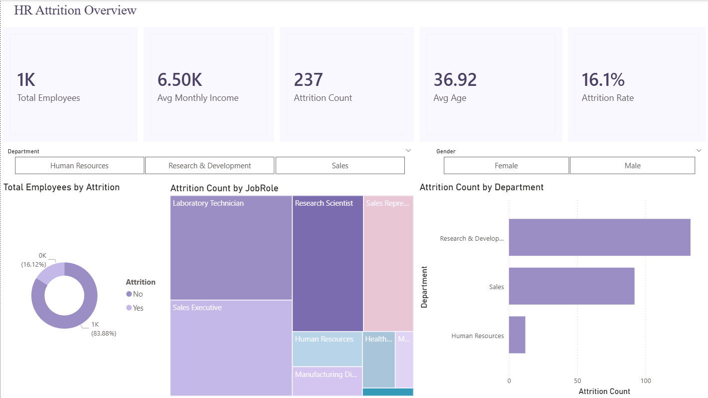
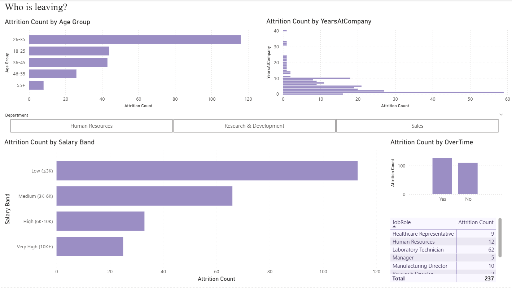
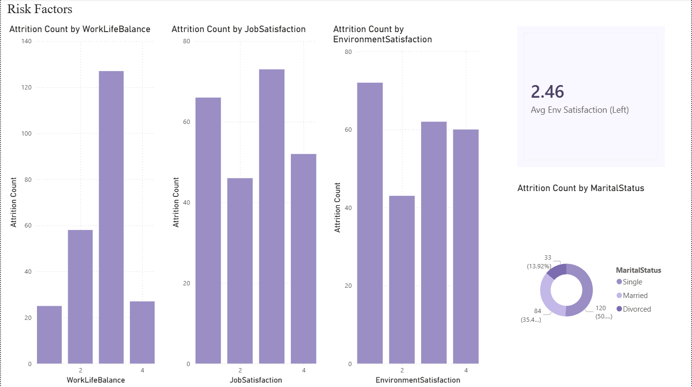

# HR Attrition Dashboard | Power BI

## Project Overview
An interactive HR analytics dashboard built in Power BI to analyse employee attrition patterns at IBM. This is Project 2 of my data analyst portfolio.

## Tools Used
- Power BI Desktop
- DAX
- IBM HR Analytics Dataset (Kaggle)

## Dataset
- Source: IBM HR Analytics Employee Attrition & Performance (Kaggle)
- 1,470 employee records | 35 columns

## Dashboard Pages

### Page 1 — Overview
- 5 KPI Cards: Total Employees, Attrition Count, Attrition Rate, Avg Age, Avg Monthly Income
- Donut Chart: Active vs Attrited employees
- Treemap: Attrition by Job Role
- Bar Chart: Attrition by Department
- Slicers: Department, Gender

### Page 2 — Who Is Leaving
- Attrition by Age Group (DAX SWITCH buckets)
- Attrition by Salary Band (DAX SWITCH buckets)
- Attrition by Years at Company
- Attrition by Overtime
- Matrix: Department × Job Role breakdown

### Page 3 — Risk Factors
- Attrition by Work-Life Balance rating
- Attrition by Job Satisfaction rating
- Attrition by Environment Satisfaction rating
- KPI Card: Avg Environment Satisfaction (Attrited employees)
- Donut Chart: Attrition by Marital Status

## Key Insights
- Overall attrition rate: **16.1%**
- Highest attrition age group: **26-35**
- Employees in the **Low salary band** leave the most
- Employees who work **overtime** have significantly higher attrition
- **Laboratory Technicians** have the highest attrition by job role
- **Single employees** leave more than married or divorced employees

## DAX Measures Created
- Total Employees
- Attrition Count
- Attrition Rate %
- Active Employees
- Avg Monthly Income
- Avg Age
- Avg Env Satisfaction (Left)

## Screenshots
### Overview

### Who Is Leaving

### Risk Factors

